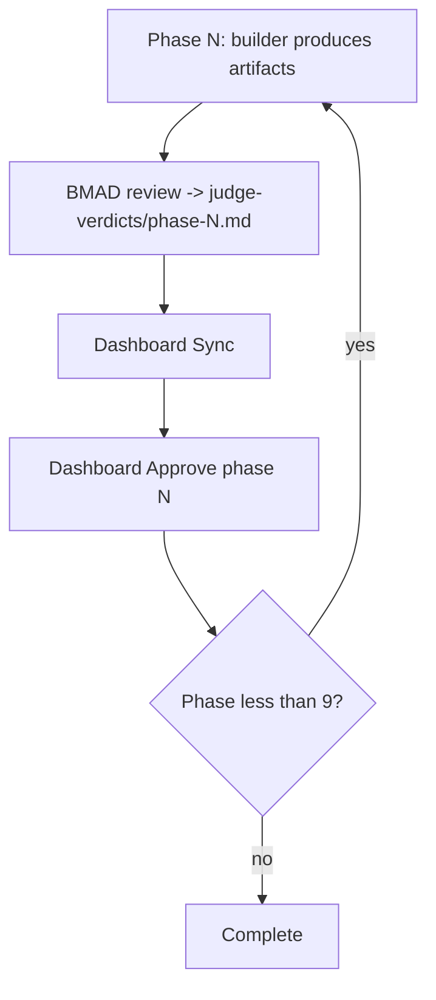

# ADF v3 — Clone, Install, and Verify (Complete Guide)

**Purpose:** Anyone can clone this repository (or copy the ADF stack) and run the orchestration dashboard + API + phase pipeline on a new machine.

**Cross-verified against:** repo layout as of 2026-05-19, `framework-routing.yaml`, `scripts/start_orchestration_dashboard.sh`, and live API ports **3847** / **3848**.

Related: [README.md](README.md) · [orchestration/ARCHITECTURE.md](orchestration/ARCHITECTURE.md) · [orchestration/WORKFLOW.md](orchestration/WORKFLOW.md) · [REPO_MANIFEST.md](REPO_MANIFEST.md)

---

## 1. What you are cloning

ADF v3 (**Proof-Governed Agentic Development**) is **not** a single binary — it is:

| Piece | Role |
|-------|------|
| **Orchestration server** | Dart Shelf API — features, gates, runner, approve |
| **Orchestration dashboard** | Flutter web/macOS UI |
| **`.cursor/orchestration/`** | Policy, routing, templates, per-feature state |
| **`.cursor/skills/`** | Cursor agent skills (orchestrator, TDD, tests, …) |
| **`scripts/orch/`** | Seed, validate, gates, worktrees |
| **Cursor IDE** | Primary execution path when headless fails |
| **Spec Kit** (external) | `speckit-*` skills for spec/plan/tasks/implement |
| **BMAD** (external) | `.agents/skills/bmad-*` discipline reviewers |

The POS app (`lib/`, `testcases/`) is **optional** for orchestration-only use; greenfield features use `products/<name>/`.

---

## 2. Prerequisites

| Requirement | Version / notes |
|-------------|-----------------|
| **Git** | 2.30+ (worktrees used in phase 7) |
| **Dart SDK** | ^3.5.0 (`dart --version`) |
| **Flutter** | Stable channel, web + macOS enabled (`flutter doctor`) |
| **curl** | Health checks in start scripts |
| **Python 3** | Telemetry scripts (optional) |
| **Cursor IDE** | With Agent mode |
| **cursor-agent CLI** | `curl -fsSL https://cursor.com/install \| bash` then `cursor-agent login` |
| **macOS / Linux** | Phase runner uses `pkill` for stuck headless agents |

---

## 3. Clone the repository

```bash
git clone https://github.com/varunkan/DineAI-POS.git ai_pos_system
cd ai_pos_system
```

> **Note:** Remote name in this repo: `origin` → `https://github.com/varunkan/DineAI-POS.git`. Use your fork if applicable.

### Minimum paths for ADF-only work

If you only need orchestration (no POS app), these directories are **required**:

```text
.cursor/orchestration/          # Policy, routing, features, templates
.cursor/skills/                 # Orchestrator + orch-* skills (partial — see §5)
.cursor/hooks/                  # Optional telemetry
.cursor/hooks.json
scripts/orch/                   # Gate + seed scripts
scripts/start_orchestration_dashboard.sh
scripts/start_orchestration_api.sh
tools/orchestration_server/
tools/orchestration_dashboard/
tools/orchestration_telemetry/  # Optional
tools/ultimate-ai-dev-framework/  # Grok pack metadata (prompts may be extended)
AGENTS.md
documents/adf/                  # This documentation archive
```

Full file list: [REPO_MANIFEST.md](REPO_MANIFEST.md).

---

## 4. One-time setup

### 4.1 Make scripts executable

```bash
chmod +x scripts/orch/*.sh scripts/start_orchestration_dashboard.sh scripts/start_orchestration_api.sh
```

### 4.2 Install Dart dependencies (API)

```bash
cd tools/orchestration_server && dart pub get && cd ../..
```

### 4.3 Install Flutter dependencies (dashboard)

```bash
cd tools/orchestration_dashboard
flutter pub get
# Web target (first time only):
flutter create . --platforms=web
cd ../..
```

### 4.4 Cursor agent authentication

```bash
./scripts/orch/setup_cursor_runner.sh
# Or manually:
cursor-agent login
# Or API key in ~/.cursor/agent.env:
#   CURSOR_API_KEY=cursor_xxxxxxxx
```

### 4.5 Environment variables

| Variable | Default | Purpose |
|----------|---------|---------|
| `ORCH_REPO_ROOT` | auto (repo root) | **Must** point at clone root when starting server |
| `ORCH_PORT` | `3847` | API port |
| `ORCH_WEB_PORT` | `3848` | Dashboard web port |
| `ORCH_AUTO_RUNNER` | `true` | Auto-queue phase 1 on feature create |
| `ORCH_SKIP_HEADLESS_PROBE` | — | `1` = skip `--print` probe (tests) |
| `ORCH_HEADLESS_ASSUME_READY` | — | `1` = use `--version` only if `--print` hangs |
| `CURSOR_API_KEY` | — | Headless auth without browser |
| `CURSOR_AGENT_PATH` | `~/.local/bin/cursor-agent` | Override agent binary |

---

## 5. External dependencies (cross-verification)

These are **referenced** in `framework-routing.yaml` but **not fully vendored** in this repo. Install or stub them before expecting full BMAD/Spec Kit automation.

### 5.1 Spec Kit skills (Cursor)

Routing expects:

- `speckit-clarify`, `speckit-constitution`, `speckit-specify`, `speckit-plan`, `speckit-tasks`, `speckit-analyze`, `speckit-implement`

**Action:** Install [Spec Kit](https://github.com/github/spec-kit) (or your team’s Cursor Spec Kit plugin) so these skills exist in Cursor. Without them, run phases manually in IDE using templates under `.cursor/orchestration/templates/`.

### 5.2 BMAD reviewer skills

Routing expects paths like:

- `.agents/skills/bmad-agent-pm/SKILL.md`
- `.agents/skills/bmad-agent-architect/SKILL.md`
- … (see `framework-routing.yaml`)

**Action:** Install [BMAD Method](https://github.com/bmad-code-org/BMAD-METHOD) (or copy `.agents/skills/` from your BMAD install) into the **repo root**.

**This clone:** `.agents/` was **not present** at documentation time — IDE + manual verdict files still work.

### 5.3 Orchestration skills in repo vs routing

| Skill in routing | In `.cursor/skills/`? | Fallback |
|------------------|----------------------|----------|
| `orch-orchestrator` | Yes | — |
| `orch-telemetry` | Yes | — |
| `orch-test-author` | Yes | — |
| `orch-self-healer` | Yes | — |
| `uaidf-tdd-executor` | Yes | — |
| `orch-review-coordinator` | **No** | Use `orch-judge` skill + merge verdicts manually; or add skill |
| `orch-product-analyst` | **No** | Agent doc: `.cursor/orchestration/agents/product-analyst.md` |
| `orch-test-architect` | **No** | Agent doc: `agents/test-architect.md` |
| `orch-verifier` | **No** | Agent doc: `agents/verifier.md` |
| `orch-code-reviewer` | Yes | — |

Deprecated (do not use as builders): `orch-spec-author`, `orch-architect`, `orch-task-decomposer`, `orch-implementer`, `orch-judge` → use Spec Kit + review coordinator.

### 5.4 UAIDF Grok pack

`tools/ultimate-ai-dev-framework/` contains `MANIFEST.yaml` and `INTEGRATION.md`. Prompt files may be extended separately; overlays are registered in `prompt-registry.yaml`.

---

## 6. Start the stack

### Recommended (API + dashboard)

```bash
export ORCH_REPO_ROOT="$(pwd)"
./scripts/start_orchestration_dashboard.sh web
```

| Service | URL |
|---------|-----|
| Dashboard | http://localhost:3848 |
| API | http://localhost:3847 |

**Important:** Browser must use **`http://localhost`** for both (not `127.0.0.1` for API from web dashboard — CORS).

### API only

```bash
./scripts/start_orchestration_api.sh
```

### Manual

```bash
export ORCH_REPO_ROOT="$(pwd)"
dart run tools/orchestration_server/bin/server.dart
# Separate terminal:
cd tools/orchestration_dashboard
flutter run -d web-server --web-hostname=localhost --web-port=3848 \
  --dart-define=ORCH_API_URL=http://localhost:3847
```

---

## 7. Verify installation

Run the verification script (from repo root):

```bash
./documents/adf/verify_setup.sh
```

Or manually:

```bash
# API
curl -sf http://localhost:3847/health
curl -sf http://localhost:3847/features

# Runner (cached probe — fast)
curl -sf http://localhost:3847/runner/health

# Dashboard
curl -sf -o /dev/null -w "%{http_code}\n" http://localhost:3848/

# Server tests
cd tools/orchestration_server && dart test

# Seed smoke feature
./scripts/orch/seed_adf_artifacts.sh adf-smoke-install
./scripts/orch/validate_adf_artifacts.sh adf-smoke-install --phase 2
```

**Expected headless behavior:** `headless_ready: false` is normal on many machines. Use **IDE mode** (§8).

---

## 8. Create your first feature (end-to-end)

### 8.1 Dashboard path

1. Open http://localhost:3848  
2. **New feature** → id `my-feature` (kebab-case), requirement text, track **M**  
3. If you see **IDE mode** — feature was created successfully; headless is optional  

### 8.2 Cursor path

```text
@orch-orchestrator start my-feature
```

Then in terminal (repo root):

```bash
./scripts/orch/seed_adf_artifacts.sh my-feature
```

### 8.3 Phase loop (summary)



| Phase | Human approve? |
|-------|----------------|
| 1–3, 9 | **Yes** |
| 4–8 | After validator + BMAD PASS |

Commands:

```text
@orch-orchestrator resume my-feature
@orch-orchestrator sync my-feature
```

### 8.4 Phase 8 gates

```bash
export ORCH_REPO_ROOT="$(pwd)"
./scripts/orch/validate_traceability.sh my-feature
./scripts/orch/coverage_gate.sh my-feature 100 --mode=both
./scripts/orch/lint_gate.sh my-feature
./scripts/orch/security_gate.sh my-feature
./scripts/orch/performance_gate.sh my-feature
```

Document waivers in `.cursor/orchestration/features/my-feature/07-verification-report.md` for greenfield packages.

---

## 9. Directory layout after first feature

```text
.cursor/orchestration/features/my-feature/
  requirement.md
  state.json
  run-status.json
  approvals.json
  judge-verdicts/phase-*.md
  00-intake.md … 08-review.md

specs/my-feature/
  spec.md
  plan.md
  tasks.md
  task-graph.yaml
  tasks/task-001.md
```

---

## 10. Troubleshooting

| Symptom | Cause | Fix |
|---------|--------|-----|
| Dashboard “API not reachable” | API down or wrong host | Start API; use `localhost` not `127.0.0.1` in browser |
| Headless error on create | `cursor-agent --print` timeout | **Not a failure** — use IDE + Sync |
| Port in use | Old process | `lsof -i :3847` / `:3848`; kill or change `ORCH_PORT` |
| Approve blocked 409 | Validator or verdict | Run `validate_adf_artifacts.sh`; check `judge-verdicts` PASS |
| `chmod +x` gate scripts fail | Permissions | `chmod +x scripts/orch/*.sh` |
| Flutter web missing | No web platform | `cd tools/orchestration_dashboard && flutter create . --platforms=web` |
| BMAD paths missing | `.agents/` not installed | Install BMAD or write verdicts manually |
| Slow dashboard | Runner health probe | Fixed in server: cached `/runner/health`; refresh dashboard |

---

## 11. Copying ADF to another repo (fork / template)

1. Copy directories listed in §3 and [REPO_MANIFEST.md](REPO_MANIFEST.md).  
2. Set `ORCH_REPO_ROOT` to new repo root.  
3. Install Spec Kit + BMAD skills in new repo.  
4. Adjust `constitution.md` for your product (replace POS-specific rules if not a POS app).  
5. Run `./documents/adf/verify_setup.sh`.  
6. Create feature `bootstrap-test` and walk phases 1–2.

---

## 12. Documentation index (this folder)

| File | Content |
|------|---------|
| [README.md](README.md) | Archive index |
| [CLONE_AND_SETUP.md](CLONE_AND_SETUP.md) | This guide |
| [REPO_MANIFEST.md](REPO_MANIFEST.md) | Path checklist |
| [orchestration/ARCHITECTURE.md](orchestration/ARCHITECTURE.md) | System design |
| [orchestration/WORKFLOW.md](orchestration/WORKFLOW.md) | Phase workflow |
| [orchestration/ADF.md](orchestration/ADF.md) | Short map |
| [related/AGENTS.md](related/AGENTS.md) | Repo `AGENTS.md` copy |

---

## 13. Support checklist for new team members

- [ ] Clone repo, `dart pub get`, `flutter pub get`, `flutter create --platforms=web`  
- [ ] `cursor-agent login` or `CURSOR_API_KEY`  
- [ ] `chmod +x scripts/orch/*.sh`  
- [ ] `./scripts/start_orchestration_dashboard.sh web`  
- [ ] Open http://localhost:3848 — green cloud, feature list loads  
- [ ] Create test feature, run `@orch-orchestrator start <id>` in Cursor  
- [ ] Read [WORKFLOW.md](orchestration/WORKFLOW.md) phases 1–3 approve flow  
- [ ] Install BMAD + Spec Kit when ready for full automation  

**Generated:** 2026-05-19 UTC
