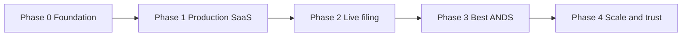

# ANDS Submission Platform — Vision Gap & Requirements

**Document:** `VISION-GAP-REQUIREMENTS.md`  
**Version:** 2.0  
**Date:** 2026-06-27  
**Status:** Draft — competitive deep-dive integrated  
**Audience:** Product, engineering, compliance, go-to-market  
**Deep inventory:** [`COMPETITIVE-REQUIREMENTS-INVENTORY.md`](COMPETITIVE-REQUIREMENTS-INVENTORY.md) (127 industry requirements from 14 vendor/benchmark loops)  
**Layered spec (UI / API / DB / DM / PERF / SEC / INT / BEST):** [`ANDS-PLATFORM-LAYERED-REQUIREMENTS.md`](ANDS-PLATFORM-LAYERED-REQUIREMENTS.md) — **315 implementable requirements**  
**Spec Kit (Microsoft SDD):** [`specs/ands-submission-platform/spec.md`](../../../specs/ands-submission-platform/spec.md) — full feature spec, plan, data model, OpenAPI, phased tasks

---

## 1. Vision

Build the **best multi-tenant SaaS platform** for **Abbreviated New Drug Submissions (ANDS)** to **Health Canada**, so any generic sponsor company can **enrol, prepare, validate, pay, transmit, and track** submissions **without buying expensive per-seat eCTD publisher licenses** or maintaining private ESG infrastructure.

### 1.1 Product promise

| Pillar | Promise |
|--------|---------|
| **File for real** | A validated transaction reaches Health Canada through **FDA ESG NextGen** (recipient `HC`) with a traceable ack chain ending in **HC Acknowledgement Receipt**. |
| **Best-in-class ANDS UX** | Guided journey from company enrolment → dossier → eCTD tree → validation → fees → review/sign → transmission → lifecycle — with a **READY / BLOCKED** dashboard, not a generic document vault. |
| **Affordable SaaS** | **Self-serve signup**, usage-based or flat-tier pricing, shared platform cost — no $50k–$200k/year publisher seat tax for mid-size generics. |
| **Regulatory correctness** | Behaviour aligned with HC sources (validation rules v5.3, CA Module 1 Schema v2.2, REP templates, CESG FAQ) — verified against live canada.ca, not marketing copy. |
| **Trust & isolation** | Each sponsor org gets **physically isolated data**, RBAC, audit trail, and optional Canadian residency — suitable for QA and inspection. |

### 1.2 Non-goals (explicit)

- Replacing qualified persons (QP) or RA judgment — the platform **assists**, sponsors **remain accountable**.
- Direct Health Canada API — **all electronic filing goes through FDA ESG NextGen** with recipient Center `HC`.
- Medical-device / IMDRF-only paths as v1 primary UX (device AI / 1.04 placement remain scoped paths).

### 1.3 Baseline (what exists today)

Reference: [`requirements-corrected.json`](requirements-corrected.json), [`VERIFICATION_2026-06-21.md`](VERIFICATION_2026-06-21.md), app [`README.md`](../../apps/ands-submission-portal/README.md).

| Layer | Today |
|-------|--------|
| **Domain** | 20+ stdlib Python modules; **370 tests**; REQ-001–070 largely implemented in logic |
| **UI** | Legacy single-page portal + multi-tenant **workspace** (REQ-071–076, 085 in code) |
| **Multi-tenant** | Control plane + per-tenant SQLite (REQ-077–084) |
| **Transmission** | **Simulated** ESG round-trip — no outbound AS2/WebTrader |
| **Production deploy** | Railway monolith (`server.py`) + Vercel proxy; **not** the FastAPI/Postgres/S3 split stack |
| **HC artifacts** | Stand-in XSD / CV / XSL bundles — not official HC binary drops |

**Gap:** The codebase is a strong **regulatory rehearsal engine** and **MVP SaaS shell**. It is **not** yet a **production filing platform** or **commercial-grade multi-tenant product**.

---

## 2. Gap register (summary)

Gaps are grouped by **blocker severity** for the vision.

### 2.1 P0 — Blocks real filing to Health Canada

| ID | Gap | Current state | Impact |
|----|-----|---------------|--------|
| **G-P0-01** | Live **FDA ESG NextGen** adapter | Simulated in `transmission.py` | Cannot deliver transactions to HC |
| **G-P0-02** | **Production/Test ESG credential vault** | Config fields only; `ESG_MODE=mock` | No secure tenant or platform ESG accounts |
| **G-P0-03** | **Inbound ack ingestion** (MDN, FDA Ack, HC Ack Receipt) | State machine only | Cannot confirm HC receipt or unblock next sequence |
| **G-P0-04** | **Official HC reference artifact pipeline** | Hand-maintained stand-ins | Validation drift vs HC validator; rejections in production |
| **G-P0-05** | **Durable package storage + checksum pipeline** | Local SQLite paths | 10 GB packages cannot be stored/transmitted reliably |
| **G-P0-06** | **Production API stack** (FastAPI + Postgres + S3 + worker) | Scaffold exists; monolith deployed | No HA, no async jobs, ephemeral SQLite on Railway |

### 2.2 P1 — Required for “best ANDS application” (functional)

| ID | Gap | REQ reference | Current state |
|----|-----|---------------|---------------|
| **G-P1-01** | Administrative / corrective sequences | REQ-048 | Not implemented |
| **G-P1-02** | Dossier transfer-of-ownership / M&A | REQ-049 | Not implemented |
| **G-P1-03** | Multi-user concurrency / sequence locking | REQ-057 | Not implemented |
| **G-P1-04** | Real **eCTD Validation Report PDF** ingest | REQ-029 | Text parser only |
| **G-P1-05** | Production-grade **PDF conformance** (OCR, DRM, bookmarks) | REQ-010–013, 069 | Heuristic checks |
| **G-P1-06** | **HC lifecycle notice ingest** (SDN, NOD, NOC, …) | REQ-030–033 | Modeled only; not ingested from HC |
| **G-P1-07** | **REP dossier-ID request** outbound to HC | REQ-002 | Local pending record; no HC round-trip |
| **G-P1-08** | Workspace UI parity on production stack | REQ-071–076, 085 | Monolith UI proxied; Next.js shell incomplete |

### 2.3 P2 — Required for multi-tenant SaaS at scale

| ID | Gap | NFR reference | Current state |
|----|-----|---------------|---------------|
| **G-P2-01** | **Commercial billing & plans** (Stripe/etc.) | New SAAS-REQ | Owner plans exist; no payment |
| **G-P2-02** | **Self-serve onboarding funnel** | REQ-077 + SAAS | Signup exists; no KYC, no ESG onboarding wizard |
| **G-P2-03** | **MFA, SSO (SAML/OIDC), session hardening** | NFR-007 | Password auth only |
| **G-P2-04** | **Encryption at rest, KMS, TLS everywhere** | NFR-007 | Edge TLS only |
| **G-P2-05** | **Observability** (metrics, tracing, SLOs) | New SAAS-NFR | None |
| **G-P2-06** | **Backup / restore / DR drills** | NFR-010, 016 | Not operationalized |
| **G-P2-07** | **Rate limits & abuse protection** | New SAAS-NFR | None |
| **G-P2-08** | **Support & status** (ticketing, incident comms) | New SAAS-NFR | None |
| **G-P2-09** | **Data export & portability** (sponsor exit) | New SAAS-REQ | Partial audit export only |
| **G-P2-10** | **Canadian residency option** (tenant-selectable) | NFR-001 | Documented as value-add; not deployable |

### 2.4 P3 — Competitive differentiation (“best”)

| ID | Gap | Notes |
|----|-----|-------|
| **G-P3-01** | **HC validator parity score** — run same ruleset as HC v5.3 with official artifacts | Marketing + trust |
| **G-P3-02** | **Collaboration** — comments, tasks, @mentions on leaves | Beats static publishers |
| **G-P3-03** | **Template library** — CS-BE, QOS-CE, cover letter, deficiency response | Faster first ANDS |
| **G-P3-04** | **Fee intelligence** — remission, 25% credit, right-to-sell calendar | REQ-034–037 partially there |
| **G-P3-05** | **Portfolio analytics** — cycle time, screening pass rate, backlog | REQ-047 seed |
| **G-P3-06** | **Accessibility (WCAG 2.1 AA)** | NFR-011 partial |
| **G-P3-07** | **Mobile-safe status** (transmission / lifecycle) | Not required for authoring |

### 2.5 P1 — Canada ANDS parity (from HC + placement table; missing in v1)

| ID | Gap | COMP ref | Current state |
|----|-----|----------|---------------|
| **G-CA-01** | **Bilingual Product Monograph** (EN + FR) authoring, diff, and leaf pairing | COMP-CA-001 | Not implemented |
| **G-CA-02** | **XML Product Monograph** build/validate (HC XML PM CV + rules) | COMP-CA-002 | Not implemented |
| **G-CA-03** | **Submission Certification Form** + **ANDS Sponsor Attestation Checklist** | COMP-CA-004/005 | Not implemented |
| **G-CA-04** | **SANDS** attestation + PM-update workflow | COMP-CA-006 | Not implemented |
| **G-CA-05** | Annotated PM **cross-reference builder** to Module 2 / 1.4.2 BE summary | COMP-CA-003 | Not implemented |
| **G-CA-06** | **CA Non-eCTD** validation profile (legacy/mandatory non-eCTD activities) | COMP-VAL-002 | Not implemented |
| **G-CA-07** | **software_version** + RT/MF field completeness gates (HC I-series/F0) | COMP-CA-010 | Partial |

### 2.6 P1 — Industry table stakes (from vendor loop; missing in v1)

| ID | Gap | COMP ref | Leaders |
|----|-----|----------|---------|
| **G-COMP-01** | **Submission content plans** — templates, tasks, deadlines, HA-compliant constraints | COMP-RIM-001 | Veeva, Ennov |
| **G-COMP-02** | **Live validation** during assembly (200+ checks class) | COMP-VAL-003 | Certara, Veeva |
| **G-COMP-03** | **CrossCheck** hyperlink/bookmark side-by-side QC | COMP-VAL-010 | Certara |
| **G-COMP-04** | **Import external eCTD** dossiers for follow-up sequences | COMP-PUB-003 | LORENZ FIVE |
| **G-COMP-05** | **Post-publish Application Viewer** (Files + XML Outline) | COMP-PUB-006 | LORENZ v25+ |
| **G-COMP-06** | **PDF auto-remediation** (OCR, embed fonts, fix links/bookmarks) | COMP-PDF-003 | Ennov, EXTEDO services |
| **G-COMP-07** | **Comments / annotations** on leaves and validation findings | COMP-WF-003 | Veeva, Certara |
| **G-COMP-08** | **Task assignment** + email notifications from content plan | COMP-WF-004 | Veeva, Ennov |
| **G-COMP-09** | **Submission archive viewer** (regulatory binder) | COMP-ARC-001 | Veeva Archive |
| **G-COMP-10** | **Registration tracking** (product × country × status) | COMP-RIM-003 | Veeva RIM, drugTrack |
| **G-COMP-11** | **HC correspondence** log (letters, commitments, queries) | COMP-RIM-004 | Veeva, Ennov |
| **G-COMP-12** | **DMS connectors** (SharePoint, Vault, Documentum) | COMP-INT-001 | EXTEDO |
| **G-COMP-13** | **Client review portal** (CRO → sponsor secure share) | COMP-CRO-002 | Phlexglobal |
| **G-COMP-14** | **Continuous publishing** when source documents change | COMP-RIM-005 | Veeva |
| **G-COMP-15** | **Batch / server-side validation** jobs | COMP-VAL-006 | LORENZ eValidator FIVE |
| **G-COMP-16** | **Extended validation profiles** (GRP beyond HC minimum) | COMP-VAL-005 | LORENZ |
| **G-COMP-17** | **Gateway submit from UI** (not manual WebTrader upload) | COMP-TRN-002 | Veeva, LORENZ Automator |
| **G-COMP-18** | **Query management** post-submission to HC | COMP-TRN-007 | AXSource, consultants |
| **G-COMP-19** | **DIN / marketed product registry** post-NOC | COMP-RIM-013 | RIM suites |
| **G-COMP-20** | **Vendor CSV package** (IQ/OQ/PQ per release) | COMP-GXP-002 | Certara, Ennov |

### 2.7 P2 — SaaS commercial gaps (benchmark: eCTD 247, LORENZ ONE)

| ID | Gap | COMP ref | Benchmark |
|----|-----|----------|-----------|
| **G-BIZ-01** | **Published pricing** — per-user/month and pay-per-sequence tiers | COMP-BIZ-002/003 | eCTD 247 ~$1k/user/mo |
| **G-BIZ-02** | **Sandbox trial** with sample ANDS dossier + guided first transmit (Test) | COMP-BIZ-005 | SaaS norm |
| **G-BIZ-03** | **Pay-per-sequence** Starter tier (no annual license) | COMP-BIZ-002 | docuBridge ONE |
| **G-BIZ-04** | **Concierge onboarding** — first ESG Test round-trip assisted | COMP-BIZ-006 | EXTEDO services |
| **G-BIZ-05** | **Managed publishing upsell** when self-serve blocked | COMP-BIZ-008 | Certara ops |

### 2.8 P3 — Differentiators (“best ANDS app” vs incumbents)

| ID | Gap | COMP ref | Notes |
|----|-----|----------|-------|
| **G-DIFF-01** | **AI content validation** (completeness, cross-sequence) | COMP-CNT-003 | LORENZ verifAI, Assyro |
| **G-DIFF-02** | **Cross-module logic validation** (M2/M3/M5 consistency) | COMP-CNT-004 | Assyro decision-tree |
| **G-DIFF-03** | **Regulatory change monitoring** → active dossier impact | COMP-CNT-005 | Assyro |
| **G-DIFF-04** | **ML document intake** unstructured → leaf assignment | COMP-CRO-004 | PhlexNeuron |
| **G-DIFF-05** | **Metadata search** across portfolio | COMP-RIM-009 | Ennov |
| **G-DIFF-06** | **Affordable multi-tenant** undercutting seat licenses | vision | Core GTM wedge |

### 2.9 Coverage vs industry (summary)

| Source | Requirements counted | Fully met today | Partial | Missing |
|--------|---------------------|-----------------|---------|---------|
| HC corpus (REQ-001–070) | 91 | ~55 | ~25 | ~11 |
| Vision v1 (REQ-087–097, SAAS) | 22 | 0 | 2 | 20 |
| **Competitive inventory (COMP-*)** | **127** | **7 (6%)** | **42 (33%)** | **78 (61%)** |
| **Combined unique backlog** | **~180** | — | — | **~110 net-new vs code** |

---

## 3. New requirements (vision delta)

These **extend** [`requirements-corrected.json`](requirements-corrected.json) (REQ-001–070). Code already implements **REQ-071–086** (dashboard, workspace UI, integrity); those should be **backfilled into the JSON corpus** separately. New IDs start at **REQ-087**.

> **Guided story experience & Prism-3D spatial UI** — the "never-before, next-level" guided filing experience (a non-regulatory person files a real ANDS and makes informed decisions) is specified as `JRNY-REQ-001..020` in [`ANDS-PLATFORM-LAYERED-REQUIREMENTS.md` §2.9](ANDS-PLATFORM-LAYERED-REQUIREMENTS.md). It is grounded in live Health Canada research and backed by the **journey BFF** (`/api/journey/*`, `apps/ands-platform/services/journey`). Approved plan: `fizzy-bouncing-rose`.

Each requirement includes: **priority**, **basis** (`HC-mandate` | `ESG-mandate` | `SaaS-product` | `value-add`), and **acceptance criteria**.

---

### 3.1 Live filing & ESG (P0)

#### REQ-087 — FDA ESG NextGen production adapter

**Priority:** MUST · **Basis:** ESG-mandate  

WHEN a tenant completes Test-gateway round-trip and holds valid Production credentials, the system SHALL transmit assembled eCTD packages to **FDA ESG NextGen** with recipient Center **`HC`**, using the tenant’s configured **WebTrader** or **AS2/EDIINT** account, and SHALL never target a direct Health Canada endpoint.

**Acceptance criteria:**

- GIVEN Production credentials and a package ≤10 GB WHEN submit THEN the adapter sends via the tenant’s ESG account and records Message ID + Core ID on success path initiation.
- GIVEN AS2 mode WHEN MDN is received THEN state advances per REQ-028 and Core ID is stored.
- GIVEN only Test credentials WHEN Production submit attempted THEN blocked with audited denial (NFR-012).
- GIVEN adapter failure (timeout, 5xx, transport reject) WHEN detected THEN no partial dossier corruption; transaction remains resumable (NFR-017).

**Traces to:** G-P0-01, REQ-003, REQ-028, production README Phase 3.

---

#### REQ-088 — Inbound acknowledgement ingestion service

**Priority:** MUST · **Basis:** ESG-mandate  

The system SHALL run a **persistent ingestion service** (poll WebTrader inbox and/or AS2 MDN listener) that parses MDN, FDA Acknowledgement, and Health Canada Acknowledgement Receipt, correlating each to the outbound transaction by **Message ID** and **Core ID**.

**Acceptance criteria:**

- GIVEN an outbound SENT transaction WHEN HC Acknowledgement Receipt arrives THEN UI shows “Received by Health Canada” and REQ-027 queue unblocks next sequence.
- GIVEN MDN only WHEN displayed THEN transport receipt shown; **not** marked received by HC.
- GIVEN duplicate ack WHEN ingested THEN idempotent store; audit logged.
- GIVEN unmatched ack WHEN ingested THEN operator queue with Core ID for manual link.

**Traces to:** G-P0-03, REQ-028, REQ-046.

---

#### REQ-089 — Official HC reference artifact registry

**Priority:** MUST · **Basis:** HC-mandate  

The platform SHALL maintain a **version-pinned registry** of HC-published artifacts, loaded as data (not hardcoded strings), including at minimum:

- eCTD Validation Rules (active ruleset, e.g. v5.3 eff 2025-05-31)
- Canadian Module 1 Schema **v2.2** XSD
- ICH eCTD **v3.2.2** DTD + util XSL
- Module 1 **controlled vocabulary** files keyed to schema version
- REP template versions (CO, RT, PI) + **REP XML stylesheet** zip
- Organization & document placement table (2024-04-02+)
- Fee tables (SOR/2019-124 + Gazette updates)

**Acceptance criteria:**

- GIVEN a new HC notice WHEN ops uploads artifact bundle THEN validation/assembly uses new version without code deploy (NFR-013).
- GIVEN generated ca-regional.xml WHEN validated THEN validated against **official** XSD bytes in registry.
- GIVEN REP XML WHEN previewed THEN rendered with version-matched stylesheet from registry (REQ-065).
- GIVEN artifact checksum mismatch WHEN loaded THEN startup fails closed with operator alert.

**Traces to:** G-P0-04, VERIFICATION template inventory gaps.

---

#### REQ-090 — eCTD package object store & job pipeline

**Priority:** MUST · **Basis:** SaaS-product  

WHEN a sponsor exports or transmits a sequence, the system SHALL store the full package in **S3-compatible object storage** (tenant-scoped prefix), compute and persist **MD5 leaf checksums** and backbone artifacts via **async workers**, and expose job status to the UI.

**Acceptance criteria:**

- GIVEN a 2 GB package WHEN assembly queued THEN worker completes without HTTP timeout; client polls job status.
- GIVEN stored package WHEN re-downloaded THEN byte-identical to assembled output (NFR-014).
- GIVEN tenant A prefix WHEN tenant B lists objects THEN zero cross-tenant keys (NFR-015).
- GIVEN failed worker WHEN retried THEN idempotent job key; no duplicate sequences.

**Traces to:** G-P0-05, G-P0-06, NFR-009.

---

#### REQ-091 — Production platform cutover

**Priority:** MUST · **Basis:** SaaS-product  

The **production** deployment SHALL run the **FastAPI backend**, **PostgreSQL**, **object storage**, **Redis queue**, and **worker** services — not the stdlib monolith — while preserving behavioural parity with the 370-test domain suite via shared modules.

**Acceptance criteria:**

- GIVEN production URL WHEN health checked THEN Postgres + S3 + worker reachable.
- GIVEN full test suite WHEN run against API harness THEN ≥370 behavioural tests pass (port or shared domain imports).
- GIVEN monolith WHEN used THEN dev/local only; not serving production traffic.
- GIVEN deploy rollback WHEN triggered THEN prior API version restorable without data loss (RPO documented).

**Traces to:** G-P0-06, `production/README.md`.

---

### 3.2 Functional completeness (P1)

#### REQ-092 — Administrative & corrective sequences

**Priority:** SHOULD · **Basis:** HC-mandate  

WHEN a sponsor must withdraw a leaf, reorganize, or file an administrative regulatory activity, the system SHALL build a **valid next sequence** with correct eCTD lifecycle operations without forcing full ANDS scientific content.

**Acceptance criteria:** per REQ-048 (port into corpus).

**Traces to:** G-P1-01.

---

#### REQ-093 — Transfer of ownership workflow

**Priority:** SHOULD · **Basis:** HC-mandate + SaaS-product  

WHEN ownership of a dossier transfers between sponsor orgs, the system SHALL preserve full sequence history and audit trail, re-scope tenant access, and file the appropriate administrative sequence.

**Acceptance criteria:** per REQ-049.

**Traces to:** G-P1-02.

---

#### REQ-094 — Collaborative editing with optimistic locking

**Priority:** SHOULD · **Basis:** SaaS-product  

WHEN multiple users edit the same dossier, the system SHALL prevent lost updates and **serialize next-sequence assignment** via record locks or conflict detection.

**Acceptance criteria:** per REQ-057.

**Traces to:** G-P1-03, NFR-019.

---

#### REQ-095 — Validation report PDF ingestion

**Priority:** MUST · **Basis:** HC-mandate  

WHEN HC emails an eCTD Validation Report PDF, the system SHALL ingest the **binary PDF** (via approved parser service), extract rule IDs and file/node mappings, and correlate by **Core ID**.

**Acceptance criteria:**

- GIVEN sample HC validation report PDFs WHEN ingested THEN ≥95% of rule rows map to dossier nodes in golden fixtures.
- GIVEN parsed errors WHEN user builds next sequence THEN defects appear in validation gutter as resolved/unresolved.

**Traces to:** G-P1-04, REQ-029.

---

#### REQ-096 — HC lifecycle notice ingestion

**Priority:** SHOULD · **Basis:** HC-mandate  

The system SHALL ingest HC-issued notices (SDN, SAL, SRL, NOD, NON, NOC, clarifax) via **secure inbox** (email parse, manual upload, or future HC channel), advance the DSTS lifecycle, and offer **response sequence** shortcuts (REQ-032).

**Acceptance criteria:**

- GIVEN uploaded SDN PDF WHEN parsed THEN screening clock and status match REQ-030.
- GIVEN NOD WHEN ingested THEN clarifax tiers offered per REQ-031 with adjustable windows.

**Traces to:** G-P1-06.

---

#### REQ-097 — Dossier ID request assist (outbound)

**Priority:** COULD · **Basis:** value-add  

WHEN a sponsor requests a new Dossier ID, the system SHALL generate the **branch-correct HC request package** (form fields + cover email template) and track status until the HC-assigned ID is entered — without claiming automated HC issuance.

**Acceptance criteria:**

- GIVEN branch pharmaceutical WHEN export THEN matches HC pharmaceutical dossier template fields.
- GIVEN HC-assigned ID WHEN entered THEN validates per REQ-002 and links to dossier workspace.

**Traces to:** G-P1-07, REQ-002.

---

### 3.3 Multi-tenant SaaS commercial layer (P2)

#### SAAS-REQ-001 — Self-serve tenant registration & trial

**Priority:** MUST · **Basis:** SaaS-product  

Any qualified company SHALL register online, verify email domain, accept terms, and receive a **trial workspace** with entitlements sufficient to complete a **Test-gateway** submission (not Production) within N days.

**Acceptance criteria:**

- GIVEN valid signup WHEN completed THEN tenant DB + default plan created atomically (REQ-077).
- GIVEN trial expired WHEN user logs in THEN read-only + upgrade prompt; data retained per retention policy.
- GIVEN abusive signup pattern WHEN detected THEN rate-limited and flagged.

**Traces to:** G-P2-02, vision “all companies can join”.

---

#### SAAS-REQ-002 — Subscription billing & entitlements

**Priority:** MUST · **Basis:** SaaS-product  

The platform SHALL offer **transparent pricing tiers** (e.g. Starter / Team / Enterprise) mapped to entitlements (REQ-082 features: dossiers, transmission, validation, seats, storage quota), integrated with a **payment provider**, and SHALL support invoice + PO for Enterprise.

**Acceptance criteria:**

- GIVEN successful payment WHEN webhook received THEN entitlements activate within 60s.
- GIVEN failed payment WHEN grace period ends THEN transmission and new sequences blocked; read/export allowed.
- GIVEN owner override WHEN applied THEN audited; effective entitlements = plan ∪ overrides (REQ-081).

**Traces to:** G-P2-01 — **replaces expensive publisher licenses**.

**Pricing principles (product, not legal):**

| Tier | Target | Includes |
|------|--------|----------|
| **Starter** | First ANDS / small generic | 1 dossier, Test ESG, validation, guided UI |
| **Team** | Active RA team | Multiple dossiers, seats, Production ESG, collaboration |
| **Enterprise** | Large portfolio | SSO, residency, SLA, dedicated support, custom retention |

---

#### SAAS-REQ-003 — Per-tenant ESG credential isolation

**Priority:** MUST · **Basis:** ESG-mandate + SaaS-product  

Each tenant SHALL store **their own** FDA ESG Test and Production credentials (certificates, AS2 IDs, secrets) in a **tenant-scoped secrets vault** (KMS-envelope encrypted). Platform operators SHALL NOT use tenant Production credentials for other tenants.

**Acceptance criteria:**

- GIVEN tenant A cert WHEN tenant B transmission runs THEN impossible via API and storage IAM.
- GIVEN cert rotation WHEN uploaded THEN Test round-trip re-required before Production unlock (REQ-003).
- GIVEN operator access WHEN viewing secrets THEN never displayed in clear text; audit logged.

**Traces to:** G-P0-02, NFR-012.

---

#### SAAS-REQ-004 — Sponsor data portability & exit

**Priority:** MUST · **Basis:** SaaS-product + PIPEDA  

WHEN a tenant terminates subscription, the system SHALL provide **full export** (dossiers, sequences, packages, audit trail, transmission ledger) in standard formats (eCTD zip, JSON, audit CSV) within 30 days.

**Acceptance criteria:**

- GIVEN export request WHEN processed THEN checksum-verified archive downloadable once.
- GIVEN legal hold WHEN active THEN deletion blocked (REQ-054).
- GIVEN export complete WHEN retention policy applies THEN tenant data deleted per schedule unless hold.

**Traces to:** G-P2-09, NFR-018.

---

#### SAAS-REQ-005 — Platform trust center

**Priority:** SHOULD · **Basis:** SaaS-product  

The platform SHALL publish **security & compliance documentation**: subprocessors, data flow diagram, RPO/RTO, penetration test summary, HC filing architecture (ESG ride-along), and basis tags (REQ-067) separating HC mandates from value-add controls.

**Traces to:** G-P2-08, enterprise sales.

---

### 3.4 Non-functional (production SaaS)

| ID | Statement | Priority |
|----|-----------|----------|
| **SAAS-NFR-001** | 99.9% monthly API availability for paid tiers; status page with incident history | MUST |
| **SAAS-NFR-002** | P95 API latency &lt; 500ms for non-package endpoints under nominal load | SHOULD |
| **SAAS-NFR-003** | MFA required for Production transmission and owner console; SSO for Enterprise | MUST |
| **SAAS-NFR-004** | All data at rest encrypted (AES-256); secrets in KMS/HSM-backed vault | MUST |
| **SAAS-NFR-005** | Daily backup + quarterly restore drill; RPO ≤ 1h, RTO ≤ 4h for Postgres + object store | MUST |
| **SAAS-NFR-006** | OpenTelemetry traces across API, worker, ESG adapter; tenant-scoped log redaction | SHOULD |
| **SAAS-NFR-007** | WCAG 2.1 AA for workspace UI (authoring flows) | SHOULD |
| **SAAS-NFR-008** | Configurable **Canada-only** region for tenant data (compute + storage + backups) | SHOULD |
| **SAAS-NFR-009** | SOC 2 Type II readiness track (controls mapped; audit optional Phase 4) | COULD |

---

### 3.5 Canada ANDS product modules (from HC + competitor gap — NEW v2)

#### REQ-098 — Bilingual Product Monograph workflow

**Priority:** MUST · **Basis:** HC-mandate · **COMP:** COMP-CA-001  

For prescription ANDS, the system SHALL manage **paired EN and FR Product Monographs** as first-class artifacts: separate leaves, version sync, placement under HC Module 1 PM headings, and validation that both languages are present before transmission.

**Acceptance criteria:**

- GIVEN prescription ANDS WHEN PM section opened THEN EN + FR upload slots are mandatory.
- GIVEN FR PM missing WHEN validate THEN blocking defect with placement-table reference.
- GIVEN EN updated WHEN FR not updated THEN warn with Plain Language Labelling timing guidance.

**Traces to:** G-CA-01.

---

#### REQ-099 — XML Product Monograph builder

**Priority:** MUST · **Basis:** HC-mandate · **COMP:** COMP-CA-002  

The system SHALL generate and validate **XML Product Monographs** per HC XML PM guidance (controlled vocabulary, rules, samples), including related image assets, for submission types where HC requires XML PM.

**Acceptance criteria:**

- GIVEN XML PM ruleset version WHEN build THEN output validates against official XSD/CV bundle in REQ-089 registry.
- GIVEN PDF-only PM WHEN XML required for activity THEN block transmit.

**Traces to:** G-CA-02.

---

#### REQ-100 — Module 1 forms & attestations pack

**Priority:** MUST · **Basis:** HC-mandate · **COMP:** COMP-CA-004/005/006  

The ANDS workspace SHALL provide fillable workflows for **Submission Certification Form**, **Sponsor Attestation Checklist for an ANDS**, and **SANDS** attestation where applicable, placing outputs in prescribed Module 1 leaves.

**Acceptance criteria:**

- GIVEN ANDS activity WHEN checklist incomplete THEN READY dashboard blocked.
- GIVEN SANDS route WHEN selected THEN attestation template switches per HC placement table.

**Traces to:** G-CA-03, G-CA-04.

---

#### REQ-101 — Annotated Product Monograph cross-reference assistant

**Priority:** MUST · **Basis:** HC-mandate · **COMP:** COMP-CA-003  

The system SHALL assist authors in building **annotated PM cross-references** to Module 2 sections and Module 1.4.2 Bioequivalence Summary, flagging broken or missing refs before validation.

**Traces to:** G-CA-05.

---

#### REQ-102 — CA Non-eCTD validation profile

**Priority:** SHOULD · **Basis:** HC-mandate · **COMP:** COMP-VAL-002  

The validator SHALL include a **CA Non-eCTD (Health Canada)** profile for regulatory activities still filed in non-eCTD electronic format per HC folder-structure zip templates.

**Traces to:** G-CA-06.

---

### 3.6 Industry parity requirements (from vendor loop — NEW v2)

#### REQ-103 — Submission content plan engine

**Priority:** MUST · **Basis:** industry-standard · **COMP:** COMP-RIM-001  

The platform SHALL provide **Submission Content Plans** with HA-compliant templates (ANDS, SNDS, SANDS), document checklist items mapped to eCTD leaves, **task assignment**, due dates, and progress roll-up to the REQ-071 readiness dashboard.

**Traces to:** G-COMP-01.

---

#### REQ-104 — Live validation engine (assembly-time)

**Priority:** MUST · **Basis:** industry-standard · **COMP:** COMP-VAL-003  

Validation SHALL run **continuously during assembly** (on leaf add/replace, metadata change, PDF upload) with severity-modeled findings within seconds, covering ≥200 technical conditions including ≥40 PDF checks (target parity with Certara Live Validation class).

**Traces to:** G-COMP-02.

---

#### REQ-105 — Hyperlink & bookmark CrossCheck QC mode

**Priority:** SHOULD · **Basis:** industry-standard · **COMP:** COMP-VAL-010  

The UI SHALL provide **side-by-side CrossCheck**: source PDF/bookmark pane vs destination pane, batch-verifying all internal hyperlinks and bookmarks before publish.

**Traces to:** G-COMP-03.

---

#### REQ-106 — External eCTD import & reconciliation

**Priority:** SHOULD · **Basis:** industry-standard · **COMP:** COMP-PUB-003  

The system SHALL **import** third-party eCTD sequences (zip), reconstruct dossier tree, checksums, and lifecycle history, and reconcile against REQ-089 schema/CV versions before adding the next sequence.

**Traces to:** G-COMP-04.

---

#### REQ-107 — Submission Application Viewer

**Priority:** SHOULD · **Basis:** industry-standard · **COMP:** COMP-PUB-006  

After publish, reviewers SHALL open an **Application Viewer** with **Files view** (folder + leaf properties) and **Outline view** (XML backbone + lifecycle ops + admin metadata).

**Traces to:** G-COMP-05.

---

#### REQ-108 — PDF remediation pipeline

**Priority:** MUST · **Basis:** industry-standard · **COMP:** COMP-PDF-003  

The platform SHALL offer a **PDF remediation job** (worker-backed): embed fonts, OCR scanned pages, generate bookmarks, strip encryption/Track Changes, fix common HC A09/B49/D29 defects, with before/after audit log.

**Traces to:** G-COMP-06.

---

#### REQ-109 — Collaboration layer (comments, tasks, notifications)

**Priority:** MUST · **Basis:** SaaS-product · **COMP:** COMP-WF-003/004  

Users SHALL attach **comments** to leaves and validation findings; managers SHALL assign **tasks** with due dates; the system SHALL send **email/in-app notifications** on assignment, blocking defect, and HC ack events.

**Traces to:** G-COMP-07, G-COMP-08.

---

#### REQ-110 — Submission archive & regulatory binder viewer

**Priority:** MUST · **Basis:** industry-standard · **COMP:** COMP-ARC-001  

Published sequences SHALL be browsable in a **Submission Archive** with regulatory binder layout, validation report attachment, transmission ledger, and read-only share links for QA.

**Traces to:** G-COMP-09.

---

#### REQ-111 — Registration & marketed product registry

**Priority:** SHOULD · **Basis:** SaaS-product · **COMP:** COMP-RIM-003/013  

The platform SHALL track **registrations** (product × country × dossier × DIN × status) and link post-NOC **right-to-sell** obligations (REQ-037) to registration records.

**Traces to:** G-COMP-10, G-COMP-19.

---

#### REQ-112 — Health authority correspondence hub

**Priority:** SHOULD · **Basis:** industry-standard · **COMP:** COMP-RIM-004  

The system SHALL log **HC correspondence** (upload/email parse): SDN, NOD, NON, NOC, clarifax, queries — linked to dossier/sequence and REQ-096 lifecycle transitions.

**Traces to:** G-COMP-11, G-P1-06.

---

#### REQ-113 — DMS integration framework

**Priority:** SHOULD · **Basis:** industry-standard · **COMP:** COMP-INT-001  

The platform SHALL provide **connectors** (API + optional agents) to ingest approved PDFs from SharePoint, OpenText Documentum, and Veeva Vault with metadata mapping to content-plan items.

**Traces to:** G-COMP-12.

---

#### REQ-114 — Sponsor client portal (CRO mode)

**Priority:** SHOULD · **Basis:** SaaS-product · **COMP:** COMP-CRO-002  

Tenants with CRO entitlement SHALL invite **sponsor users** to a scoped **client portal**: view progress, comment, approve, without seeing other sponsors’ data.

**Traces to:** G-COMP-13.

---

#### REQ-115 — Gateway transmit from UI

**Priority:** MUST · **Basis:** ESG-mandate · **COMP:** COMP-TRN-002  

Beyond REQ-087, the workspace SHALL expose **Transmit to Test/Production** actions that invoke the ESG adapter, show live status, and surface ack artifacts in the transmission console without leaving the app.

**Traces to:** G-COMP-17.

---

#### REQ-116 — Batch validation service

**Priority:** SHOULD · **Basis:** industry-standard · **COMP:** COMP-VAL-006  

The platform SHALL queue **batch validation** jobs (multiple sequences, full dossier) on workers with downloadable PDF/JSON reports — parity with eValidator FIVE server mode.

**Traces to:** G-COMP-15.

---

#### REQ-117 — Extended validation profile (GRP)

**Priority:** SHOULD · **Basis:** value-add · **COMP:** COMP-VAL-005  

Tenants MAY enable **Extended/GRP profiles** — stricter checks beyond HC minimum — configurable per tenant QA policy.

**Traces to:** G-COMP-16.

---

#### REQ-118 — Vendor CSV / Part 11 package

**Priority:** SHOULD · **Basis:** SaaS-product · **COMP:** COMP-GXP-002  

Each major release SHALL ship a **CSV documentation pack** (IQ/OQ/PQ scripts, trace matrix REQ→test, Part 11 feature map) for customer qualification.

**Traces to:** G-COMP-20.

---

### 3.7 SaaS commercial requirements (expanded v2)

#### SAAS-REQ-006 — Pay-per-sequence Starter tier

**Priority:** MUST · **Basis:** SaaS-product · **COMP:** COMP-BIZ-002  

Offer a **Starter** plan billed **per published sequence** (not annual seat license), including validation + Test ESG transmit, targeting first-time generic sponsors.

**Traces to:** G-BIZ-03.

---

#### SAAS-REQ-007 — Public pricing page & calculator

**Priority:** MUST · **Basis:** SaaS-product · **COMP:** COMP-BIZ-003  

Publish **transparent pricing** (per-user/month tiers + per-sequence add-on + Enterprise PO) with a **cost calculator** comparing vs typical docuBridge/GlobalSubmit TCO.

**Traces to:** G-BIZ-01.

---

#### SAAS-REQ-008 — Sandbox tenant with golden ANDS dossier

**Priority:** MUST · **Basis:** SaaS-product · **COMP:** COMP-BIZ-005  

Provide a **sandbox** environment pre-loaded with a golden ANDS dossier (e123456/0000) for training, sales demos, and CSV IQ tests.

**Traces to:** G-BIZ-02.

---

#### SAAS-REQ-009 — Concierge first-filing program

**Priority:** SHOULD · **Basis:** SaaS-product · **COMP:** COMP-BIZ-006  

Offer optional **concierge onboarding**: ESG account setup, Test round-trip, first Production ANDS filing with regulatory ops support (paid add-on).

**Traces to:** G-BIZ-04.

---

#### SAAS-REQ-010 — Managed publishing services marketplace

**Priority:** COULD · **Basis:** SaaS-product · **COMP:** COMP-BIZ-008  

When self-serve publish fails or tenant selects overflow, offer **managed publishing** via partner CRO/API — handoff from same content plan.

**Traces to:** G-BIZ-05.

---

#### SAAS-REQ-011 — Public REST API & webhooks

**Priority:** MUST · **Basis:** SaaS-product · **COMP:** COMP-INT-004/005  

Documented **REST API** for dossiers, validation, jobs, transmission status; **webhooks** for `sequence.published`, `validation.failed`, `transmission.hc_ack`.

**Traces to:** G-COMP (integrations).

---

### 3.8 Differentiator requirements (best ANDS — NEW v2)

#### REQ-119 — Regulatory change impact engine

**Priority:** COULD · **Basis:** vendor-differentiator · **COMP:** COMP-CNT-005  

When HC publishes notices affecting rulesets, fees, or templates in REQ-089, the platform SHALL compute **impact** on active tenant dossiers and notify owners.

**Traces to:** G-DIFF-03.

---

#### REQ-120 — Cross-module consistency engine

**Priority:** SHOULD · **Basis:** vendor-differentiator · **COMP:** COMP-CNT-004  

Beyond flat eCTD rules, validate **semantic consistency** across Module 2 QOS, Module 3 CMC tables, and Module 5 BE summaries (parameter names, strengths, study IDs).

**Traces to:** G-DIFF-02.

---

#### REQ-121 — AI-assisted content completeness (optional tier)

**Priority:** COULD · **Basis:** vendor-differentiator · **COMP:** COMP-CNT-003  

Optional **AI tier** validates document **completeness vs ANDS checklist** (missing sections, inconsistent terminology) — labeled value-add, not HC-mandated; human override required.

**Traces to:** G-DIFF-01.

---

#### REQ-122 — Unstructured document intake (optional tier)

**Priority:** COULD · **Basis:** vendor-differentiator · **COMP:** COMP-CRO-004  

Optional ML pipeline proposes **leaf placement** from uploaded DOC/PDF packets; user confirms before commit (PhlexNeuron-class).

**Traces to:** G-DIFF-04.

---

## 4. Phased delivery roadmap

Phases are **sequenced by dependency**. Each phase has **exit gates** before the next.

### Phase 0 — Foundation (4–6 weeks)

**Goal:** Stable product engineering base + competitive requirements baseline.

| Deliverable | Requirements |
|-------------|--------------|
| Backfill REQ-071–086 into JSON corpus | Documentation |
| Publish COMP inventory + v2 gap doc | Documentation |
| Fix README stale scope bullets | Documentation |
| CI: domain tests + API parity harness | SAAS-NFR-006 seed |
| Official artifact download + checksum script | REQ-089 prep |
| **HC forms inventory** (Certification, Attestation, XML PM) | REQ-100 prep |

**Exit gate:** 370 tests green; artifact registry spec approved; COMP coverage baseline accepted.

---

### Phase 1 — Production SaaS stack (8–12 weeks)

**Goal:** Multi-tenant product on durable infra — mock ESG + **SaaS commercial shell**.

| Deliverable | Requirements |
|-------------|--------------|
| FastAPI + Postgres + S3 + Redis + worker in production | REQ-091, REQ-090 |
| Port workspace UI to production frontend | G-P1-08 |
| MFA, encryption at rest, backups | SAAS-NFR-003–005 |
| Self-serve signup + trial + Stripe tiers | SAAS-REQ-001, 002, **006, 007, 008** |
| Tenant secrets vault | SAAS-REQ-003 |
| **Public API + webhooks** | SAAS-REQ-011 |
| **Submission content plans (MVP)** | REQ-103 |
| **Comments + tasks (MVP)** | REQ-109 |

**Exit gate:** Paying trial tenant completes mock transmission; **public pricing live**; sandbox dossier available.

---

### Phase 2 — Live filing to Health Canada (12–16 weeks)

**Goal:** First real HC Ack Receipt + **Canada ANDS Module 1 parity**.

| Deliverable | Requirements |
|-------------|--------------|
| FDA ESG NextGen Test + Production adapter | REQ-087, **REQ-115** |
| Inbound ack service | REQ-088 |
| Official HC artifact registry | REQ-089 |
| PDF validation report ingest | REQ-095 |
| **PDF remediation pipeline** | REQ-108 |
| **Live validation (core 200 checks)** | REQ-104 |
| **Module 1 forms pack** | REQ-100 |
| **Bilingual PM workflow** | REQ-098 |
| Operator runbook + ESG wizard | SAAS-REQ-003, **009** |

**Exit gate:** Pilot sponsor: live Test → live Production → HC Ack; **ANDS checklist + EN/FR PM** complete in pilot dossier.

---

### Phase 3 — Industry parity (10–14 weeks)

**Goal:** Match **Certara/LORENZ/Veeva** table stakes for ANDS generics.

| Deliverable | Requirements |
|-------------|--------------|
| Admin/corrective sequences | REQ-092 |
| Concurrency / locking | REQ-094 |
| HC notice + correspondence hub | REQ-096, **REQ-112** |
| Transfer of ownership | REQ-093 |
| **Import external eCTD** | REQ-106 |
| **Application Viewer + Archive** | REQ-107, REQ-110 |
| **CrossCheck QC** | REQ-105 |
| **Registration + DIN registry** | REQ-111 |
| **Batch validation + GRP profile** | REQ-116, REQ-117 |
| **CA Non-eCTD profile** | REQ-102 |
| **DMS connector (SharePoint MVP)** | REQ-113 |
| **CRO client portal** | REQ-114 |
| **Vendor CSV pack** | REQ-118 |
| Template library + portfolio analytics | G-P3-03–05 |

**Exit gate:** Independent benchmark: ≥95% eValidator CA eCTD parity on golden set; pilot NPS ≥40.

---

### Phase 4 — Differentiators & trust (ongoing)

| Deliverable | Requirements |
|-------------|--------------|
| **XML Product Monograph** | REQ-099 |
| **Annotated PM cross-ref assistant** | REQ-101 |
| **Cross-module consistency** | REQ-120 |
| **Regulatory change impact** | REQ-119 |
| **AI completeness tier (optional)** | REQ-121 |
| **ML document intake (optional)** | REQ-122 |
| Canadian residency deployment | SAAS-NFR-008 |
| SOC 2 track | SAAS-NFR-009 |
| WCAG audit | SAAS-NFR-007 |
| Managed publishing marketplace | SAAS-REQ-010 |

---

## 5. Success metrics (vision KPIs)

| Metric | Target | Phase |
|--------|--------|-------|
| **Live HC Ack Receipt rate** | 100% of Production submits get Core ID + HC Receipt | 2 |
| **HC validation parity** | ≥98% agreement with HC pre-check on golden dossiers | 2 |
| **Time to first Test transmission** | &lt; 5 business days from signup (with sponsor cert) | 1–2 |
| **Cost vs publisher** | &lt; 20% of typical annual eCTD seat + validator cost for Team tier | 1 |
| **Tenant isolation incidents** | 0 cross-tenant data leaks | 1+ |
| **Platform availability** | 99.9% paid tier | 1+ |
| **Screening deficiency rate (pilot)** | ≤10% first sequence | 3 |
| **eValidator CA parity** | ≥95% agreement on golden dossier set | 3 |
| **Time to first paid sequence (Starter)** | &lt; 1 day from signup to publish (mock) | 1 |
| **Module 1 forms completeness** | 100% pilot ANDS include Certification + Attestation | 2 |
| **Competitive feature coverage** | ≥70% COMP-MUST implemented | 3 |

---

## 6. Competitive parity matrix (summary)

Full 127-row inventory: [`COMPETITIVE-REQUIREMENTS-INVENTORY.md`](COMPETITIVE-REQUIREMENTS-INVENTORY.md).

| Capability | LORENZ | Veeva | Certara | Ennov | **Us today** | **Us target (Ph 3)** |
|------------|--------|-------|---------|-------|--------------|----------------------|
| HC eCTD validation | ●●● | ●●● | ●●● | ●●● | ●○○ | ●●● |
| Live validation | ●●○ | ●●● | ●●● | ●●○ | ●○○ | ●●● |
| ESG transmit | ●●○ | ●●● | ●●○ | ●●○ | ○○○ | ●●● |
| Submission content plans | ●○○ | ●●● | ●●○ | ●●● | ○○○ | ●●○ |
| ANDS Module 1 forms/PM | ●●○ | ●●○ | ●●○ | ●●○ | ○○○ | ●●● |
| Bilingual/XML PM | ●○○ | ●●○ | ●○○ | ●○○ | ○○○ | ●●○ |
| Multi-tenant SaaS pricing | ●○○ | ●●○ | ●●○ | ●●● | ○○○ | ●●● |
| AI content validation | ●●○ | ●○○ | ○○○ | ●●○ | ○○○ | ●●○ |
| CRO client portal | ●○○ | ●●○ | ●○○ | ●●○ | ○○○ | ●●○ |
| Import external eCTD | ●●● | ●●○ | ●●○ | ●●○ | ○○○ | ●●○ |

Legend: ●●● strong · ●●○ adequate · ●○○ partial · ○○○ missing

**Strategic wedge:** multi-tenant **affordable SaaS** (SAAS-REQ-006/007) + **guided ANDS-native UX** (REQ-071–076) + **HC-verified domain** (370 tests) — while closing COMP-CA and COMP-VAL gaps in Ph 2–3.

---

## 7. Traceability matrix (gap → requirement → phase)

| Gap | Requirement | Phase |
|-----|-------------|-------|
| G-P0-01 | REQ-087 | 2 |
| G-P0-02 | SAAS-REQ-003 | 1–2 |
| G-P0-03 | REQ-088 | 2 |
| G-P0-04 | REQ-089 | 0–2 |
| G-P0-05 | REQ-090 | 1 |
| G-P0-06 | REQ-091 | 1 |
| G-P1-01 | REQ-092 | 3 |
| G-P1-02 | REQ-093 | 3 |
| G-P1-03 | REQ-094 | 3 |
| G-P1-04 | REQ-095 | 2 |
| G-P1-06 | REQ-096 | 3 |
| G-P1-07 | REQ-097 | 3 |
| G-P2-01 | SAAS-REQ-002 | 1 |
| G-P2-02 | SAAS-REQ-001 | 1 |
| G-P2-03–04 | SAAS-NFR-003, 004 | 1 |
| G-P2-06 | SAAS-NFR-005 | 1 |
| G-P2-10 | SAAS-NFR-008 | 4 |
| G-CA-01 | REQ-098 | 2 |
| G-CA-02 | REQ-099 | 4 |
| G-CA-03 | REQ-100 | 2 |
| G-CA-05 | REQ-101 | 4 |
| G-CA-06 | REQ-102 | 3 |
| G-COMP-01 | REQ-103 | 1 |
| G-COMP-02 | REQ-104 | 2–3 |
| G-COMP-03 | REQ-105 | 3 |
| G-COMP-04 | REQ-106 | 3 |
| G-COMP-05 | REQ-107 | 3 |
| G-COMP-06 | REQ-108 | 2 |
| G-COMP-07/08 | REQ-109 | 1–3 |
| G-COMP-09 | REQ-110 | 3 |
| G-COMP-10/19 | REQ-111 | 3 |
| G-COMP-11 | REQ-112 | 3 |
| G-COMP-12 | REQ-113 | 3 |
| G-COMP-13 | REQ-114 | 3 |
| G-COMP-17 | REQ-115 | 2 |
| G-COMP-15/16 | REQ-116, 117 | 3 |
| G-COMP-20 | REQ-118 | 3 |
| G-BIZ-01/03 | SAAS-REQ-007, 006 | 1 |
| G-BIZ-02 | SAAS-REQ-008 | 1 |
| G-BIZ-04 | SAAS-REQ-009 | 2 |
| G-DIFF-01/02/03 | REQ-121, 120, 119 | 4 |
| G-DIFF-04 | REQ-122 | 4 |

---

## 8. Open decisions (product owner)

| # | Decision | Options |
|---|----------|---------|
| 1 | **ESG model** | Per-tenant ESG accounts (recommended) vs platform-shared WebTrader |
| 2 | **PDF engine** | Managed microservice (MuPDF/pdfium) vs third-party API |
| 3 | **Pricing** | Per-dossier vs per-seat vs hybrid |
| 4 | **Monolith fate** | Dev-only vs gradual route port |
| 5 | **Residency** | Single-region CA deploy vs tenant-selectable |
| 6 | **Pilot sponsor** | First live filing partner + validation parity benchmark |
| 7 | **XML PM scope** | Phase 2 bilingual PDF only vs Phase 4 full XML PM |
| 8 | **Validation parity target** | License LORENZ eValidator vs rebuild parity engine |
| 9 | **AI tier** | Build vs partner (verifAI-class) for REQ-121 |
| 10 | **CRO GTM** | White-label CRO tenants as primary vs direct sponsor GTM |

---

## 9. Related documents

| Document | Purpose |
|----------|---------|
| [`COMPETITIVE-REQUIREMENTS-INVENTORY.md`](COMPETITIVE-REQUIREMENTS-INVENTORY.md) | **127 industry requirements** from 14 vendor loops |
| [`ANDS-PLATFORM-LAYERED-REQUIREMENTS.md`](ANDS-PLATFORM-LAYERED-REQUIREMENTS.md) | **315 layered reqs** — UI, API, DB, DM, PERF, SEC, INT, BEST |
| [`requirements-corrected.json`](requirements-corrected.json) | Baseline 70 FR + 21 NFR |
| [`VERIFICATION_2026-06-21.md`](VERIFICATION_2026-06-21.md) | HC source verification |
| [`../../apps/ands-submission-portal/production/README.md`](../../apps/ands-submission-portal/production/README.md) | Split-stack deploy |
| [`../../apps/ands-submission-portal/production/DEPLOY.md`](../../apps/ands-submission-portal/production/DEPLOY.md) | Railway + Vercel |

---

## 10. Document maintenance

- **Owner:** Product + orchestration feature `ands-submission-portal`
- **Update when:** Phase exit gates met, vendor major releases (LORENZ/Veeva/Certara), HC notices, or pilot filing feedback
- **Next step:** Merge REQ-098–122 + SAAS-REQ-006–011 into `requirements-corrected.json`; seed ADF feature from §3

---

*v2.0 closes the gap between “regulatory rehearsal MVP” and “multi-tenant SaaS that matches LORENZ/Veeva/Certara table stakes while filing ANDS to Health Canada for real.”*
