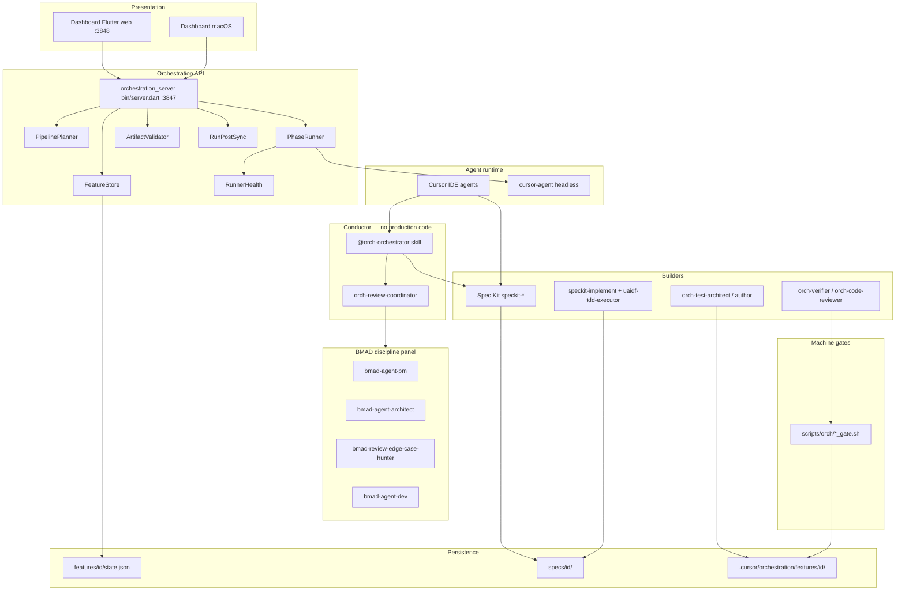
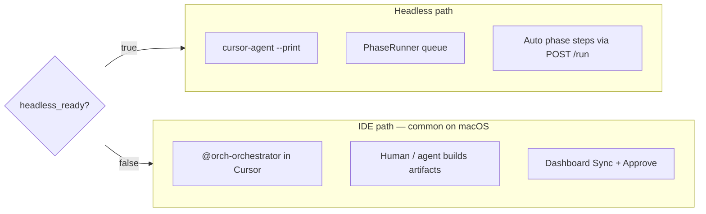

# ADF v3 — System Architecture

**Proof-Governed Agentic Development (PGAD)** for the AI POS monorepo and greenfield products under `products/`.

Related docs: [WORKFLOW.md](WORKFLOW.md) · [ADF.md](ADF.md) · [framework-routing.yaml](framework-routing.yaml) · [AGENTS.md](../../AGENTS.md)

---

## 1. Architectural goals

| Goal | Mechanism |
|------|-----------|
| **Proof before progress** | Artifacts on disk + machine scripts + BMAD verdicts |
| **No duplicate agents** | Single builder per phase in `framework-routing.yaml` |
| **Deterministic steps** | Grok principles A–E (`grok-determinism.md`) |
| **Human control** | Dashboard approve on phases 1–3 and 9 |
| **POS safety** | No `lib/` edits until phase 7 and `tests_red` |
| **Auditability** | `state.json`, `approvals.json`, `judge-verdicts/`, OTEL traces |

---

## 2. Layered architecture



---

## 3. Component reference

### 3.1 Conductor

| Component | Path | Responsibility |
|-----------|------|----------------|
| **orch-orchestrator** | `.cursor/skills/orch-orchestrator/SKILL.md` | Sole coordinator; reads routing; dispatches builders + review coordinator; never writes production code |
| **orch-review-coordinator** | `.cursor/skills/orch-review-coordinator/SKILL.md` | Merges parallel BMAD reviews into `judge-verdicts/phase-N.md` |

### 3.2 Policy and routing

| File | Role |
|------|------|
| [ADF.md](ADF.md) | System map and agent read order |
| [constitution.md](constitution.md) | POS rules, RACI, coverage mandate |
| [grok-determinism.md](grok-determinism.md) | Principles A–E, TDD order, conflict precedence |
| [framework-routing.yaml](framework-routing.yaml) | Per-phase builders, reviewers, gates, outputs |
| [protocol.md](protocol.md) | Agent protocol and handoffs |
| [adf-grok-refinement.md](adf-grok-refinement.md) | Grok 6 ↔ ADF 9 mapping |

### 3.3 Builders (by framework)

| Framework | Phases | Outputs |
|-----------|--------|---------|
| **Spec Kit** | 2–4, 7 | `spec.md`, `plan.md`, `tasks.md`, `task-graph.yaml`, `tasks/`, code |
| **orch-product-analyst** | 1 | `00-intake.md` |
| **orch-test-architect** | 5 | `04-test-plan.md` |
| **orch-test-author** | 6 | `05-test-cases.md`, `06-traceability-matrix.md` |
| **orch-verifier** | 8 | `07-verification-report.md` |
| **orch-code-reviewer** | 9 | `08-review.md` |
| **uaidf-tdd-executor** | 7 overlay | RED→GREEN→REFACTOR discipline on micro-tasks |

Deprecated (do not use as builders when Spec Kit is listed): `orch-spec-author`, `orch-architect`, `orch-task-decomposer`, `orch-implementer`.

### 3.4 Orchestration server

| Module | Path | Role |
|--------|------|------|
| **Server** | `tools/orchestration_server/bin/server.dart` | REST API, CORS, approve/sync/commands |
| **FeatureStore** | `lib/feature_store.dart` | CRUD features, gates, repair pipeline state, reconcile reviewers |
| **PipelinePlanner** | `lib/pipeline_planner.dart` | Build phase 0–9 plan for UI from routing + state |
| **PhaseRunner** | `lib/phase_runner.dart` | Queue/run `cursor-agent`; IDE fallback when headless off |
| **RunPostSync** | `lib/run_post_sync.dart` | After run: verdict → state, `awaiting_user` |
| **ArtifactValidator** | `lib/artifact_validator.dart` | Checklist API for phases 2–4 |
| **RunnerHealth** | `lib/runner_health.dart` | Auth probe, headless liveness, version probe |

**Environment variables:**

| Variable | Default | Purpose |
|----------|---------|---------|
| `ORCH_REPO_ROOT` | repo root | Feature paths, scripts |
| `ORCH_AUTO_RUNNER` | `true` | Auto-queue phase 1 on create |
| `ORCH_SKIP_HEADLESS_PROBE` | — | Skip `--print` probe (tests) |
| `ORCH_HEADLESS_ASSUME_READY` | — | Use `--version` only for `headless_ready` |
| `CURSOR_API_KEY` | — | Headless auth without login |

### 3.5 Dashboard

| Piece | Path | Role |
|-------|------|------|
| **Flutter app** | `tools/orchestration_dashboard/` | List/detail, pipeline rail, chat, approve |
| **ApiClient** | `lib/services/api_client.dart` | REST to `:3847` |
| **api_config** | `lib/config/api_config.dart` | Web uses `http://localhost:3847` (CORS) |

Start: `./scripts/start_orchestration_dashboard.sh web` → http://localhost:3848

### 3.6 Machine gate scripts

| Script | Gate key | Scope |
|--------|----------|--------|
| `validate_traceability.sh` | `r100` | Spec ↔ tests matrix |
| `coverage_gate.sh` | `l100`, `l100_repo`, `l100_feature` | Coverage thresholds |
| `lint_gate.sh` | `lint_clean` | POS `lib/` analyze |
| `security_gate.sh` | `security_clean` | Security heuristics |
| `performance_gate.sh` | `performance_clean` | Performance heuristics |
| `validate_adf_artifacts.sh` | (shape/DAG) | Pre-approve phases 2–4 |

### 3.7 Grok reference pack

| Path | Role |
|------|------|
| `tools/ultimate-ai-dev-framework/` | Vendored UAIDF prompts and MANIFEST — **overlay only**, not the production conductor |

---

## 4. Data model

### 4.1 Feature directory layout

```text
.cursor/orchestration/features/<feature-id>/
  requirement.md          # Client intent + clarifications
  state.json              # Phase, gates, completed_* skills
  run-status.json         # Runner: idle | running | queued | needs_login
  approvals.json          # Human approve/revise/reject history
  commands.jsonl          # Dashboard chat commands
  run-log.jsonl           # Runner events
  otel-traces.jsonl       # Agent/tool traces (optional)
  phase-request.json      # Queued phase for headless runner
  00-intake.md            # Phase 1 orchestration artifact
  04-test-plan.md         # Phase 5
  05-test-cases.md        # Phase 6
  06-traceability-matrix.md
  07-verification-report.md
  08-review.md
  judge-verdicts/
    phase-1.md … phase-9.md
  last-agent-response.md

specs/<feature-id>/
  spec.md                 # Phase 2
  plan.md                 # Phase 3
  tasks.md                # Phase 4
  task-graph.yaml         # DAG for phase 7
  tasks/task-*.md         # Micro-tasks
  checklists/             # Optional Spec Kit
  research.md, data-model.md, contracts/, quickstart.md  # Phase 3
```

### 4.2 `state.json` (essential fields)

| Field | Meaning |
|-------|---------|
| `feature_id` | Canonical id |
| `current_phase` | 0–9 work phase (repaired by server on sync) |
| `status` | `active` \| `completed` \| `rejected` |
| `gates` | Boolean map keyed by `phase_gate_map` (+ phase 8 sub-gates) |
| `gate_waivers` | Documented exceptions (e.g. greenfield L100) |
| `completed_builders` | `{ "2": ["speckit-specify"], … }` |
| `completed_reviewers` | `{ "2": ["bmad-agent-pm", …], … }` |
| `awaiting_user` | Show approval bar in dashboard |
| `pending_approval_phase` | Phase awaiting approve |
| `last_judge_verdict` | `pass` \| `revise` \| `fail` |
| `track` | `S` \| `M` \| `L` \| `XL` |
| `spec_feature_dir` | Usually `specs/<feature-id>` |
| `heal_attempts` / `correct_attempts` | Recovery counters (phases 10–11) |

### 4.3 Phase gate map (`framework-routing.yaml` → `phase_gate_map`)

| Phase | Gate key |
|-------|----------|
| 1 | `problem_statement_approved` |
| 2 | `requirements_complete` |
| 3 | `plan_covers_all_requirements` |
| 4 | `tasks_atomic_and_traced` |
| 5 | `test_strategy_approved` |
| 6 | `tests_red` |
| 7 | `tests_green` |
| 8 | `all_quality_gates_pass` (+ sub-gates `r100`, `l100*`, `lint_clean`, `security_clean`, `performance_clean`) |
| 9 | `review_approved` |

---

## 5. REST API (summary)

Base: `http://localhost:3847` (browser dashboard should use **localhost**, not `127.0.0.1`, for CORS).

| Method | Path | Purpose |
|--------|------|---------|
| GET | `/health` | Server + `ORCH_REPO_ROOT` |
| GET | `/runner/health` | Auth + cached headless status |
| POST | `/runner/verify-print` | Force headless `--print` probe |
| GET | `/features` | List summaries (`count` field) |
| POST | `/features` | Create feature (`mode`: `ide_only` \| `queued`) |
| GET | `/features/:id` | Full detail + pipeline + conversation |
| GET | `/features/:id/pipeline` | Pipeline steps for UI rail |
| GET | `/features/:id/conversation` | Chat transcript for UI |
| GET | `/features/:id/commands` | Command history |
| POST | `/features/:id/commands` | Chat message; optional execute |
| POST | `/features/:id/sync-state` | Reconcile artifacts → `state.json` |
| POST | `/features/:id/approve` | Human gate advance |
| GET | `/features/:id/artifact-checklist?phase=N` | Validator checklist before approve |
| GET | `/features/:id/run-status` | Runner state |
| GET | `/features/:id/run-log` | Runner event log |
| POST | `/features/:id/run` | Queue headless phase run |
| POST | `/features/:id/request-phase` | Queue specific phase for runner |
| POST | `/features/:id/heal` | Trigger self-heal (recovery phase 10) |
| POST | `/features/:id/cancel` | Cancel in-flight run |
| POST | `/features/:id/unstick` | Clear stuck runner flags |
| POST | `/features/:id/retry` | Retry failed run |
| GET | `/features/:id/traces` | OTEL-style traces (`reasoning_only`, `limit` query params) |

---

## 6. Execution modes



| Signal | Meaning |
|--------|---------|
| `ready: true` | `cursor-agent` authenticated |
| `headless_ready: true` | `--print` responded within timeout |
| `resume_mode: cursor_ide` | Use IDE + Sync |
| `headless_unavailable: true` | Not an error; IDE workflow |

Create feature with `mode: ide_only` when headless is unavailable; use `queued` when runner can auto-start.

---

## 7. Greenfield vs brownfield

| Type | Code location | Tests | Phase 8 notes |
|------|---------------|-------|----------------|
| **Brownfield POS** | `lib/`, `testcases/` | POS harness | Full gate scripts on `lib/` |
| **Greenfield** | `products/<pkg>/` or paths in `spec.md` | Package tests | L100/lint may be **waived**; document in `07-verification-report.md` and `gate_waivers` |

Declare in `specs/<id>/spec.md`: `package_root`, `source_paths`. Do not assume POS `lib/` unless scoped.

---

## 8. Telemetry

| Piece | Path |
|-------|------|
| Skill | `.cursor/skills/orch-telemetry/SKILL.md` |
| Hooks | `.cursor/hooks.json` |
| Ingest | `tools/orchestration_telemetry/bin/ingest_event.py` |
| Session | `tools/orchestration_telemetry/bin/set_session.py` |
| Query CLI | `tools/orchestration_telemetry/bin/query_traces.py` |
| API | `GET /features/:id/traces?reasoning_only=true` |

See [tools/orchestration_telemetry/README.md](../../tools/orchestration_telemetry/README.md).

---

## 9. Recovery phases (non-pipeline)

| Phase ID | Name | Agent | Max attempts |
|----------|------|-------|--------------|
| 10 | heal | `orch-self-healer` | 3 |
| 11 | correct | `orch-self-corrector` | 2 |

Triggered after build/test/gate failures; API `POST /features/:id/heal` may queue heal. Superpowers: `systematic-debugging` on heal.

---

## 10. Anti-duplication rules

From `framework-routing.yaml` → `anti_duplication`:

1. One primary builder per phase (optional second only if `optional: true`).
2. Never run deprecated `orch-spec-author`, `orch-architect`, `orch-task-decomposer`, `orch-implementer` when Spec Kit equivalent exists.
3. Never run `bmad-create-*` in-pipeline after Spec Kit specify/plan/tasks.
4. All BMAD reviews go through `orch-review-coordinator`, not direct `orch-judge`.
5. Grok/UAIDF prompts are **overlays** only — see `prompt-registry.yaml`.
6. Record completed skills in `state.json` `completed_builders` / `completed_reviewers` per phase.

---

## 11. Version

- **ADF v3.0.0** — Proof-Governed Agentic Development with full Grok fidelity overlay.
