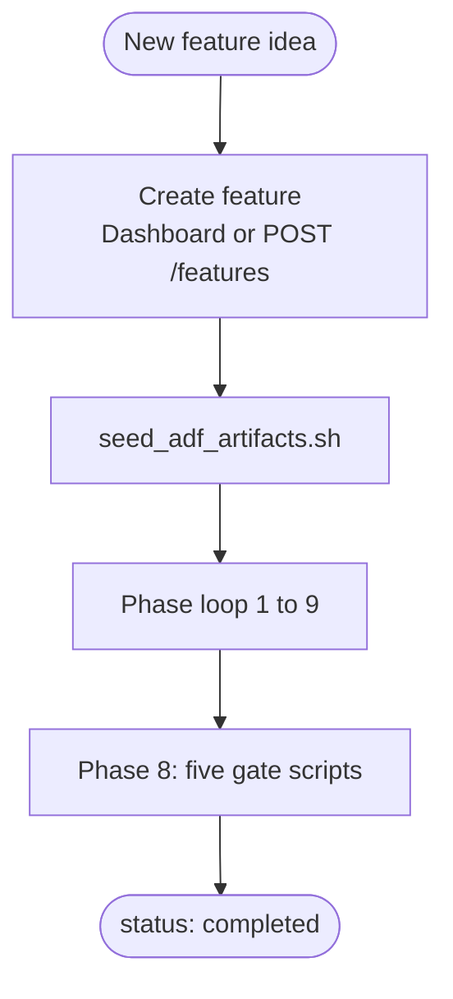
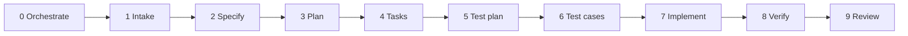
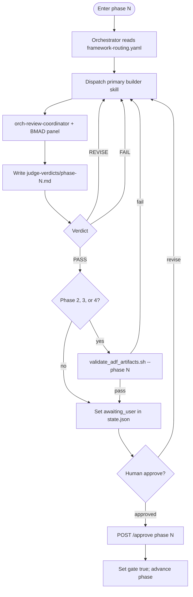
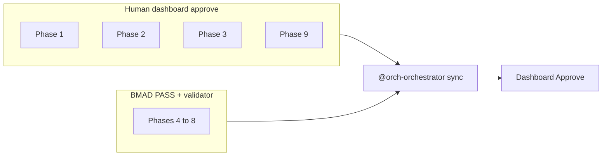
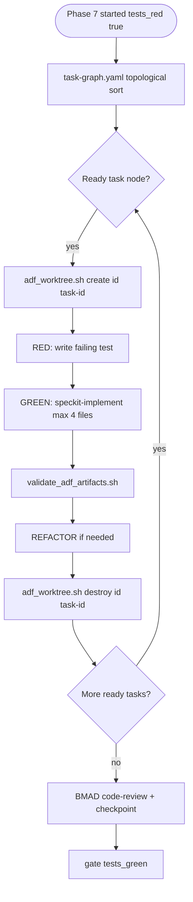
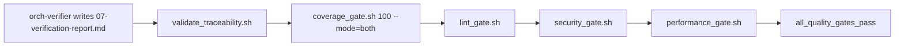
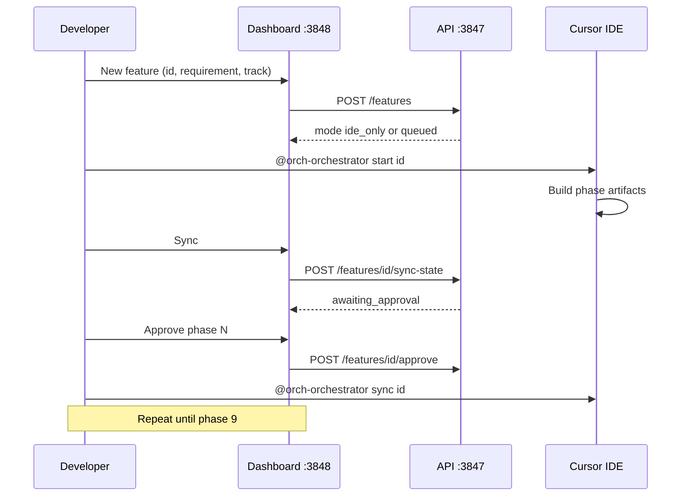
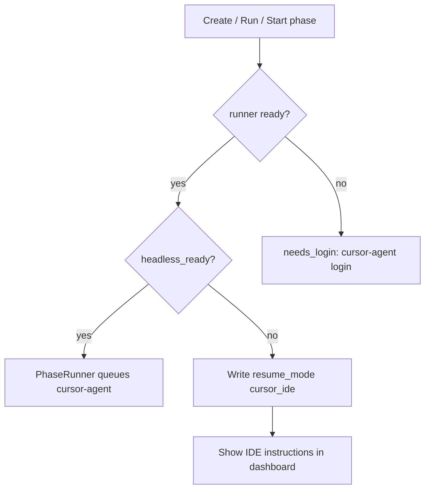

# ADF v3 — Complete Workflow

End-to-end workflow for **Proof-Governed Agentic Development**: from new feature to `status: completed`.

Related: [ARCHITECTURE.md](ARCHITECTURE.md) · [ADF.md](ADF.md) · [adf-grok-refinement.md](adf-grok-refinement.md) · [framework-routing.yaml](framework-routing.yaml)

---

## 1. Workflow overview



**Orchestrator commands:**

```text
@orch-orchestrator start <feature-id>
@orch-orchestrator resume <feature-id>
@orch-orchestrator sync <feature-id>
```

After dashboard **Approve**, run `@orch-orchestrator sync <id>` so gates and phase advance match disk (BMAD PASS or documented waiver required).

---

## 2. Phase pipeline (0–9)



### Phase reference table

| Phase | Name | Primary builder | Key outputs | Gate (`phase_gate_map`) | Human approve? |
|-------|------|-----------------|-------------|-------------------------|----------------|
| 0 | Orchestrate | Bootstrap / sync Spec Kit | `specs/<id>/` dir | — | No |
| 1 | Intake | orch-product-analyst | `00-intake.md` | `problem_statement_approved` | **Yes** |
| 2 | Specify | speckit-specify | `spec.md`, checklists | `requirements_complete` | **Yes** |
| 3 | Plan | speckit-plan | `plan.md`, research, contracts | `plan_covers_all_requirements` | **Yes** |
| 4 | Tasks | speckit-tasks (+ analyze optional) | `tasks.md`, `task-graph.yaml`, `tasks/` | `tasks_atomic_and_traced` | Validator + BMAD |
| 5 | Test plan | orch-test-architect | `04-test-plan.md` | `test_strategy_approved` | BMAD |
| 6 | Test cases | orch-test-author | `05-test-cases.md`, `06-traceability-matrix.md` | `tests_red` | BMAD |
| 7 | Implement | speckit-implement + uaidf-tdd-executor | Code under declared paths | `tests_green` | BMAD |
| 8 | Verify | orch-verifier + scripts | `07-verification-report.md` | `all_quality_gates_pass` | Machine |
| 9 | Review | orch-code-reviewer | `08-review.md` | `review_approved` | **Yes** |

Phases **4–8** auto-unblock when validator + BMAD verdict PASS (unless waived). Phases **1–3** and **9** require human dashboard approval per [ADF.md](ADF.md).

**Rule:** Do not edit POS `lib/` until phase **7** and `gates.tests_red == true`.

---

## 3. Per-phase workflow (build → review → approve)

Every phase follows the same pattern:



### BMAD reviewers by phase

| Phase | Reviewers |
|-------|-----------|
| 1 | bmad-agent-analyst, bmad-review-adversarial-general |
| 2 | bmad-agent-pm, bmad-validate-prd |
| 3 | bmad-agent-architect, bmad-check-implementation-readiness |
| 4 | bmad-agent-pm (trace), bmad-review-adversarial-general |
| 5 | bmad-review-edge-case-hunter, bmad-qa-generate-e2e-tests |
| 6 | bmad-review-edge-case-hunter, bmad-agent-dev |
| 7 | bmad-code-review, bmad-checkpoint-preview |
| 8 | (machine gates; orch-verifier) |
| 9 | bmad-code-review, bmad-agent-tech-writer |

---

## 4. Human vs automated gates



| Action | When |
|--------|------|
| **Approve** | Verdict PASS (or documented waiver in `gate_waivers`) |
| **Revise** | Verdict REVISE; re-run builder |
| **Reject** | Stop feature (`status: rejected`) |

Before approve phases **2–4**:

```bash
./scripts/orch/validate_adf_artifacts.sh <feature-id> --phase <N>
```

Use dashboard artifact checklist: `GET /features/<id>/artifact-checklist?phase=N`.

---

## 5. Phase 7 — micro-task implementation workflow



Steps (orchestrator / implementer):

1. Read `specs/<id>/task-graph.yaml` for ready tasks (topological order; v3.0 sequential only).
2. `adf_worktree.sh create <id> <task-id>`
3. `speckit-implement` + **required** `uaidf-tdd-executor` on tracks M/L/XL
4. `validate_adf_artifacts.sh <id>`
5. `adf_worktree.sh destroy <id> <task-id>`
6. Repeat until graph complete

### Grok principles in phase 7

| Principle | Application |
|-----------|-------------|
| **A** | ≤ 4 files per agent invocation |
| **B** | DAG order from `task-graph.yaml` |
| **C** | Tests and artifacts before gate |
| **D** | 30–90 s per micro-task (`max_duration_seconds` ≤ 90) |
| **E** | Isolated git worktree per task |

### TDD order (mandatory)

1. **RED** — failing test exists  
2. **GREEN** — minimal production code  
3. **REFACTOR** — clean up  
4. **Commit** in worktree  
5. Destroy worktree  

---

## 6. Phase 8 — verification workflow



Run manually (set `ORCH_REPO_ROOT` if needed):

```bash
./scripts/orch/validate_traceability.sh <feature-id>
./scripts/orch/coverage_gate.sh <feature-id> 100 --mode=both
./scripts/orch/lint_gate.sh <feature-id>
./scripts/orch/security_gate.sh <feature-id>
./scripts/orch/performance_gate.sh <feature-id>
```

Shrink [coverage_baseline.json](../../scripts/orch/coverage_baseline.json) each PR toward repo-wide 100%.

**Greenfield:** document waivers in `07-verification-report.md` and `state.json` → `gate_waivers`.

---

## 7. Dashboard workflow (operator)



### Dashboard screens

| Screen | Actions |
|--------|---------|
| **Feature list** | List features, search, new feature, connection status |
| **Feature detail** | Pipeline rail, chat, inspector, approve bar, runner card |
| **New feature** | Create id + requirement + track (S/M/L/XL) |

Start stack:

```bash
dart run tools/orchestration_server/bin/server.dart
./scripts/start_orchestration_dashboard.sh web
# Dashboard: http://localhost:3848
# API: http://localhost:3847
```

---

## 8. Headless vs IDE execution workflow



| Mode | When | What you do |
|------|------|-------------|
| **Headless** | `headless_ready: true` | Dashboard **Run** or `POST /features/:id/run` |
| **IDE** | `headless_ready: false` | `@orch-orchestrator resume <id>` in Cursor, then **Sync** |

Headless unavailable is **not a failure** — feature is created; work continues in IDE.

Optional: `POST /features/:id/request-phase` to queue a specific phase; `POST /cancel`, `/unstick`, `/retry` for runner control.

---

## 9. Grok ↔ ADF phase map

| Grok phase | ADF phases | Human approve |
|------------|------------|---------------|
| 0 Init | 0 orchestrate | No |
| 1 Spec | 1–2 intake, specify | Yes (1–2) |
| 2 Architecture | 3 plan | Yes (3) |
| 3 Task breakdown | 4 tasks | Validator + BMAD |
| 4 Execution | 5–7 test + implement | BMAD; worktrees |
| 5 Verification | 8 verify | Machine gates |
| 6 Integration | 9 review | Yes (9) |

See [adf-grok-refinement.md](adf-grok-refinement.md).

---

## 10. Recovery workflow

```mermaid
flowchart TD
  Fail[Build test or gate failure]
  Heal{heal attempts less than 3?}
  H[orch-self-healer phase 10]
  APIheal[POST /features/id/heal]
  Correct{correct attempts less than 2?}
  C[orch-self-corrector phase 11]
  Resume[@orch-orchestrator resume]

  Fail --> Heal
  Heal -->|yes| H
  Heal -->|yes| APIheal
  H --> Resume
  APIheal --> Resume
  Heal -->|no| Correct
  Correct -->|yes| C --> Resume
  Correct -->|no| Blocked[Investigate manually]
```

---

## 11. Pre-approve checklists

| Phase | Required before Approve |
|-------|-------------------------|
| 1 | `00-intake.md`, expanded `requirement.md` |
| 2 | `specs/<id>/spec.md` |
| 3 | `specs/<id>/plan.md` |
| 4 | `tasks.md`, `task-graph.yaml`, `tasks/*.md` (DAG valid) |
| 5 | `04-test-plan.md` |
| 6 | `05-test-cases.md`, `06-traceability-matrix.md`, RED tests |
| 7 | Tests green, micro-tasks done |
| 8 | `07-verification-report.md`, all five gate scripts pass or waived |
| 9 | `08-review.md`, BMAD PASS |

---

## 12. Typical day-one path (new feature)

1. **Create** feature in dashboard (`payment-v2`, track M).  
2. Note **IDE mode** message if headless unavailable.  
3. `./scripts/orch/seed_adf_artifacts.sh payment-v2`  
4. In Cursor: `@orch-orchestrator start payment-v2`.  
5. Complete **phase 1** intake → Sync → **Approve** phase 1 → `sync payment-v2`.  
6. Repeat for phases 2–3 (human approve each).  
7. Phases 4–6: builders + validator where required; tests RED by phase 6 gate.  
8. Phase 7: micro-tasks in worktrees until `tests_green`.  
9. Phase 8: run five gate scripts; document waivers if greenfield.  
10. Phase 9: `08-review.md` → **Approve** → `status: completed`.

---

## 13. Script index

| Script | Purpose |
|--------|---------|
| `scripts/orch/seed_adf_artifacts.sh` | Initialize spec + feature dirs |
| `scripts/orch/validate_adf_artifacts.sh` | Shape + DAG validation |
| `scripts/orch/validate_traceability.sh` | R100 |
| `scripts/orch/coverage_gate.sh` | L100 |
| `scripts/orch/lint_gate.sh` | Lint |
| `scripts/orch/security_gate.sh` | Security |
| `scripts/orch/performance_gate.sh` | Performance |
| `scripts/orch/adf_worktree.sh` | Phase 7 isolation |
| `scripts/orch/sync_speckit_feature.sh` | Spec Kit feature dir sync |
| `scripts/orch/setup_cursor_runner.sh` | Runner setup helper |
| `scripts/start_orchestration_dashboard.sh` | API + dashboard |
| `scripts/start_orchestration_api.sh` | API only |

---

## 14. Document index

| Doc | Content |
|-----|---------|
| [ARCHITECTURE.md](ARCHITECTURE.md) | Layers, components, API, data model |
| [WORKFLOW.md](WORKFLOW.md) | This file — phases and operator flow |
| [ADF.md](ADF.md) | Short system map |
| [constitution.md](constitution.md) | Policy |
| [grok-determinism.md](grok-determinism.md) | Principles A–E |
| [framework-routing.yaml](framework-routing.yaml) | Machine-readable routing |
| [AGENTS.md](../../AGENTS.md) | Repo entry for agents |
